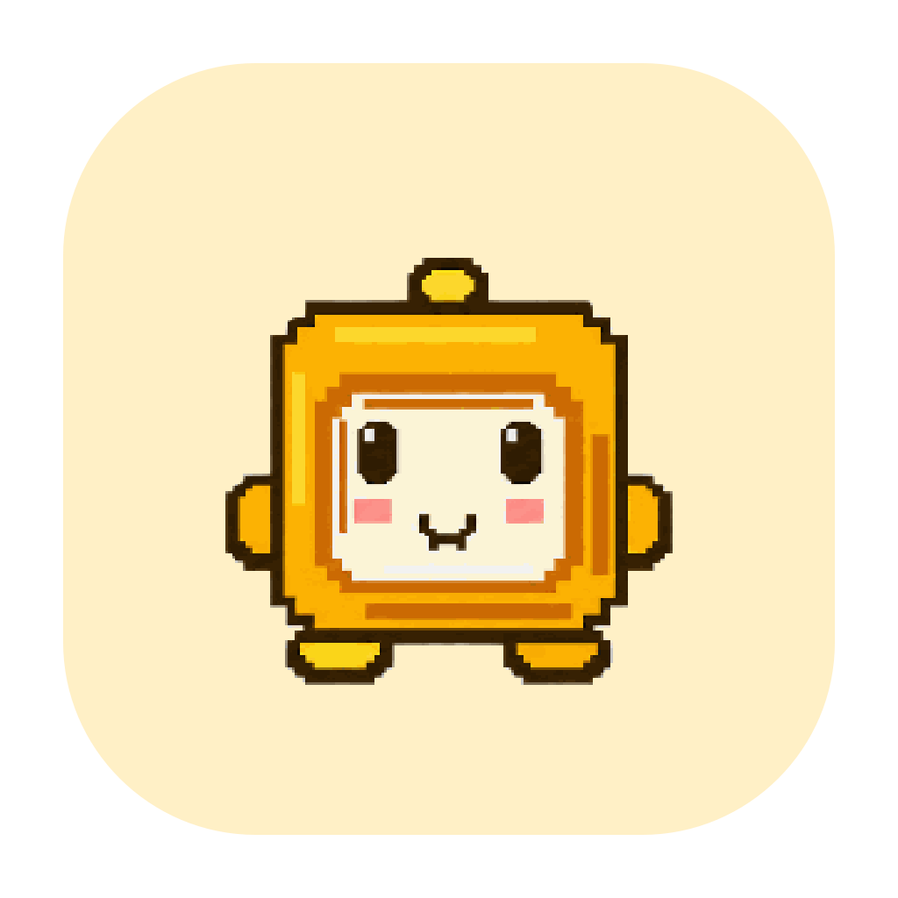
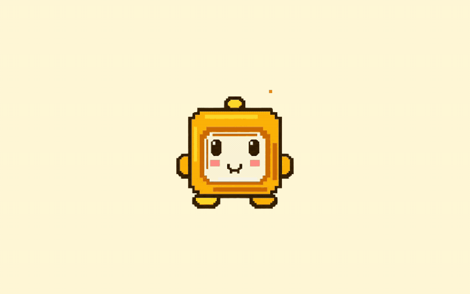
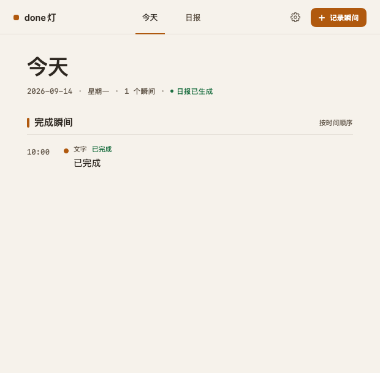
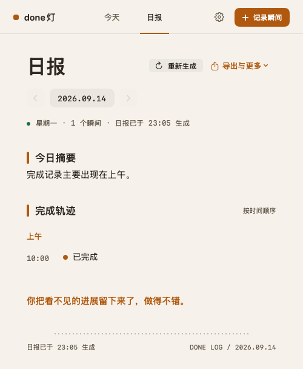

  

<h1 align="center">done灯</h1>

  <strong>你已经做了很多，别让它们悄悄消失。</strong> 
  给 P 人的完成记录器：不用先列清单，也能拥有顶级 J 人一项项打勾的爽感。

  
  

  macOS 14.0+ · Apple Silicon + Intel · 已签名并通过 Apple 公证

  

## 你不是没完成，只是没来得及记下

回完一串消息、改好一版方案、处理掉突然冒出来的问题、把生活里一件没人看见的小事安顿好、终于让那个拖了很久的念头落地……很多真正消耗过你的事，从来没有出现在 Todo 里。

所以忙完一天，你还是可能觉得：**我今天到底做了什么？**

done灯 不催你规划人生，也不要求你先成为更自律的人。做完一件事时按一下，它就用声音和亮起的表情回应你，再把这一刻稳稳放进今天。

> 不是逼自己完成更多，而是把已经做到的事，还给自己。

## P 人，也能收获清空待办的爽感

- **做完再记，不用提前规划**：没有列进清单的事，也配拥有一个漂亮的勾。
- **每按一次，都有回音**：反馈不等 AI；你的完成先被看见，识别慢慢在后台补上。
- **晚上收下完整的今天**：每天 23:00，零散的完成会变成一张清楚、真实的时间线。

## 三步，把今天的完成感收回来

1. **做完就按一下**：轻点桌面上的 done灯，听见回应；如果按错了，长按约 2 秒撤销。
2. **看见它落进今天**：查看、补充或修改完成事项，让每一次推进都有着落。
3. **晚上打开日报**：你会发现——原来今天的自己，已经安静地做完了这么多。

  
  

每一次按下，都在替今天留下证据。

## 你决定，它记多少

| 方式 | 会截图吗 | 内容会去哪里 | 适合谁 |
| --- | --- | --- | --- |
| 仅记录 | 不会 | 只在本机保存完成时间和你填写的内容 | 只想快速留下完成瞬间 |
| 本地模型 | 主动按下时截取一次 | 交给本机 Ollama 识别 | 希望自动识别，同时尽量留在本机 |
| Codex Agent（在线） | 主动按下时截取一次 | 交给在线 Codex Agent 识别 | 已在使用 Codex，希望少配置 |
| 模型 API | 主动按下时截取一次 | 发送到你配置的模型服务 | 希望自己选择在线模型服务 |

不想用 AI，就选“仅记录”；想少写一点，就让模型帮你认。识别模式可以选择“智能单窗”或“当前显示器”。done灯 不会持续录屏，只有在你主动按下时才会截取当时的画面。

## 你的完成，只按你的方式被看见

- 选择“仅记录”时，不截图、不需要屏幕录制权限，也不调用模型。
- 只有选择识别模式后，done灯 才会请求 macOS 屏幕录制权限。
- 截图保留期限可以在设置中修改，也可以立即删除本机全部截图。
- 识别、权限或模型失败时，真实完成时间仍会保留并可手动补充。
- 提交公开反馈时，请勿上传私人截图、窗口标题、日志原文、API Key 或其他敏感信息。

## 现在开始，把今天留下来

1. 下载并双击 [`done-lamp-0.3.4.dmg`](https://github.com/LearnPrompt/done-lamp-releases/releases/download/v0.3.4/done-lamp-0.3.4.dmg)。
2. 在弹出的窗口里，把 `done灯.app` 拖到“应用程序”。
3. 从“应用程序”打开 done灯，按引导选择“仅记录”、本地模型或在线识别。

## 当前版本

| 项目 | 信息 |
| --- | --- |
| 版本 | `0.3.4 (8)` · 初代公测版 |
| 系统 | macOS 14.0 或更高版本 |
| 架构 | Apple Silicon 与 Intel 通用安装包 |
| 安全 | Developer ID 签名、Apple 公证并装订凭据 |
| 安装包 | `done-lamp-0.3.4.dmg` · 约 42.7 MB |
| SHA-256 | `8066c77b74f9709432e01423ed0000be3efb51bfde6c17cb45b72010e208413b` |

完整改动见 [0.3.4 Release Notes](https://github.com/LearnPrompt/done-lamp-releases/releases/tag/v0.3.4) 和 [CHANGELOG](CHANGELOG.md)。

## 常见问题

### 一定要用 AI 吗？

不用。首次启动时选择“仅记录”，done灯 只保存完成时间和你手动填写的内容。你不需要为了获得完成感，再配置一套复杂工具。

### 为什么识别模式需要屏幕录制权限？

这是 macOS 对屏幕截图统一使用的系统权限。done灯 只在你主动按下时截取一次，不会持续录屏。

### 遇到问题怎么办？

请先查看 [已有反馈](https://github.com/LearnPrompt/done-lamp-releases/issues)，确认没有重复后再：

- [报告问题](https://github.com/LearnPrompt/done-lamp-releases/issues/new?template=bug_report.yml)
- [提出建议](https://github.com/LearnPrompt/done-lamp-releases/issues/new?template=feature_request.yml)

## 关于这个仓库

这里是 done灯 的公开下载与反馈仓库，用于发布经过签名和 Apple 公证的安装包、更新日志和公开问题，不包含应用源码。
